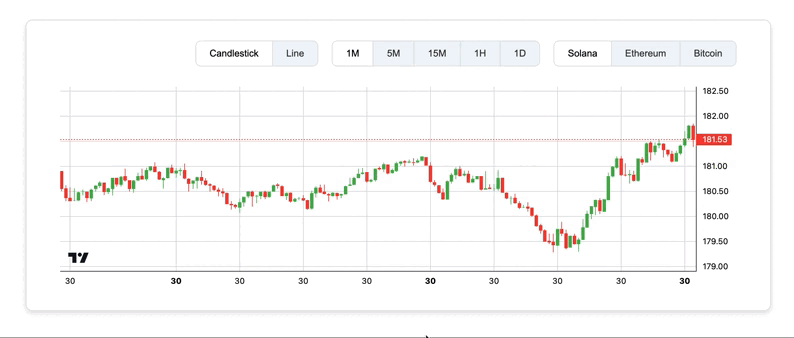

# Приложение для отслеживания криптовалютных графиков

Приложение позволяет пользователям отслеживать графики криптовалют для Solana, Ethereum и Bitcoin. Пользователи могут выбирать временной интервал и тип графика (свечной или линейный) для визуализации данных. Приложение удобно и интуитивно понятно, что делает его отличным инструментом для анализа криптовалют.

## Демонстрация

<p align="left">
 
</p>

## Стартовый комплект React Parcel с Lightweight Charts

Этот проект представляет собой минимальный стартовый проект React, который использует [Parcel JS](https://www.parceljs.org) для сборки проекта. Он основан на [простом примере React](https://tradingview.github.io/lightweight-charts/tutorials/react/simple) из документации TradingView Lightweight Charts.

## Стек технологий

- **React**: JavaScript-библиотека для создания пользовательских интерфейсов
- **Parcel**: Быстрый веб-пакет для быстрой сборки проектов
- **Lightweight Charts**: Библиотека для создания высококачественных графиков
- **Axios**: Библиотека для выполнения HTTP-запросов
- **Zustand**: Легковесный менеджер состояния
- **Binance API**: Источник данных для криптовалют
- **WebSocket**: Для получения данных в реальном времени

## Установка и запуск

### Предварительные требования

- Установите последнюю [LTS версию Node.js](https://nodejs.org/en/download/)
- Установите последнюю версию [npm](https://www.npmjs.com/)

### Как установить

Скачайте себе репозиторй

```bash
 git clone git@github.com:Tciganskybaron/TradingView.git
 cd your-repo-directory
```

### Как запустить

После завершения вышеуказанных шагов, установите зависимости и запустите сервер разработки:

```bash
npm install
npm start
```

